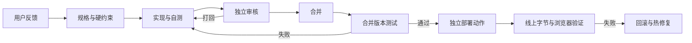

# 全流程 / Workflow

先从真实用户触发条件写规格，再把任务交给实现者。审核者必须自己复跑命令、检查数据来源与截图，不能把实现报告当验收。一次 REVIEW 对应一轮可执行修改；合并后测试的提交标识必须与发布的一致。

三条产线共享接口先行、先测量再修、证据化审核、测试与部署分离。音乐视频以时间为主轴，并以审核人亲自点播的“实时可看”作为 G2G3/FINAL 必检子项（[播放测试](06-testing.md)），截图不能代验；三维模拟以数据来源与空间一致性为主轴；体感游戏以真实输入、可开始性和安全退出为主轴。

每个项目生成在 projects/<name>/。过程产物为 SPEC → REPORT → REVIEW → RELEASE，线上小范围修复用 HOTFIX。样板不等于最终产品，初始场景与合成骨架只用于验证工具和接口。

English: Feedback becomes a measurable specification. Implementers supply reproducible evidence; reviewers run checks independently. Merge first, test the merged revision, release as a separate authorized action, then verify delivered bytes and real browser behavior. A passing local report does not prove production correctness.

需要持续打磨空间、材质和镜头的项目，继续阅读[深做制作法](11-deep-production.md)：最多四个主场景、多变体、一场景一负责人、四阶段制作、美术总监评审与集成契约。

音乐视频 v0.5 使用[逐镜预热常驻播放器](../tracks/music-video/realtime/README.md)，并按[独立世界规则](12-distinct-worlds.md)设计。原分层播放器是实验选项。
